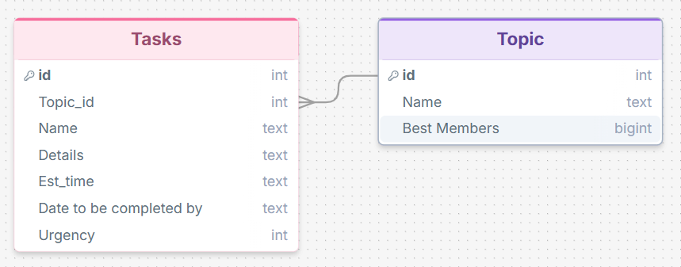
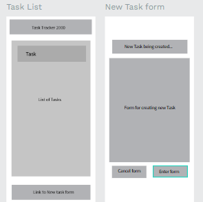
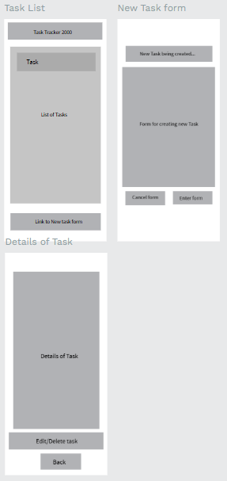
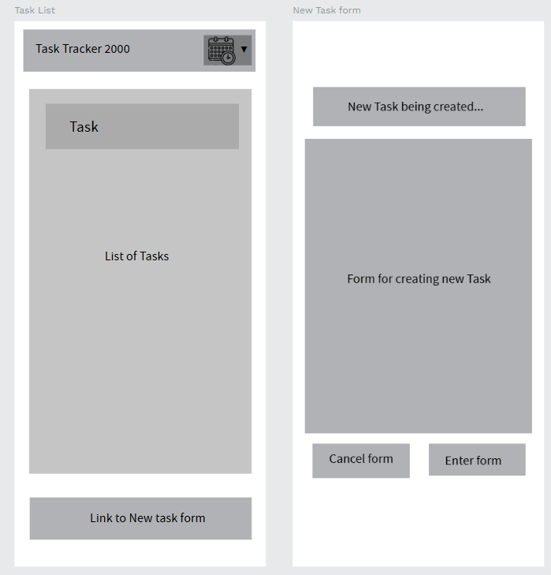
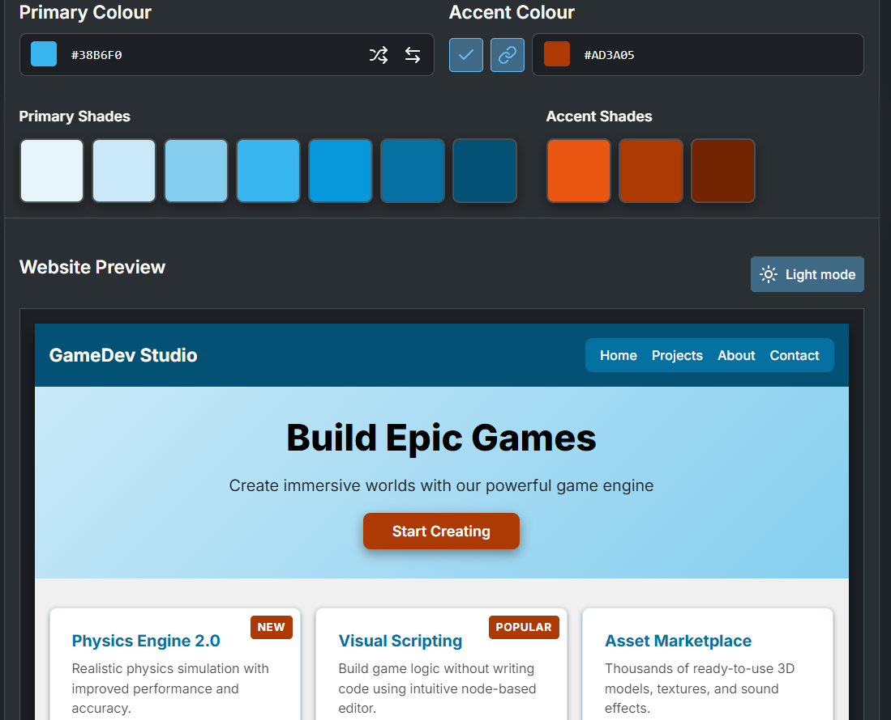
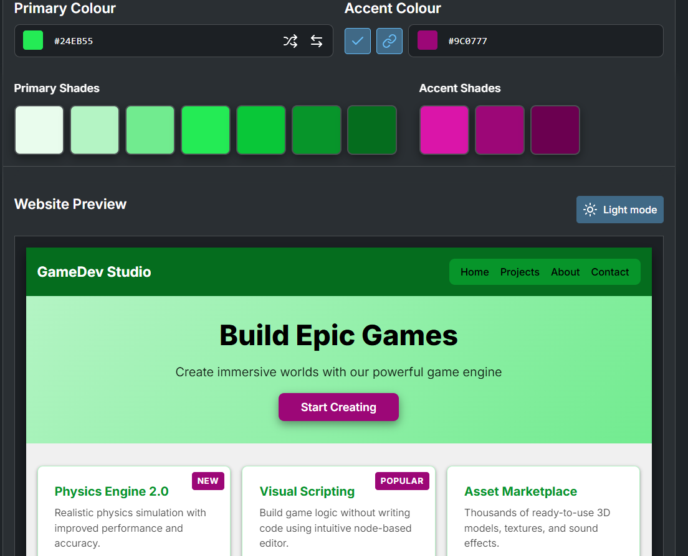
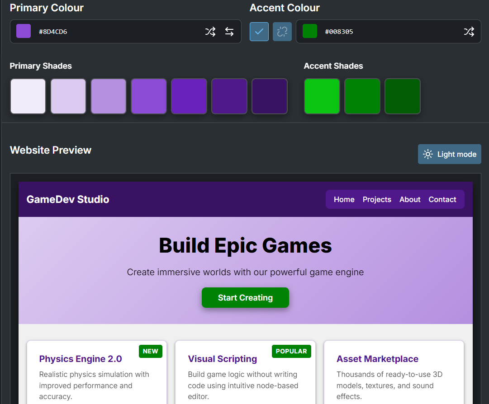
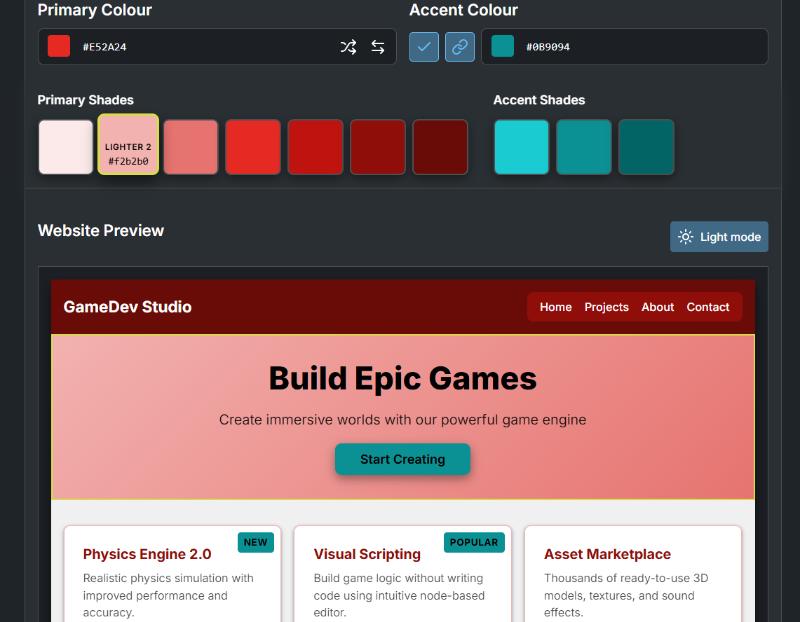

# Sprint 1 - Developing a DB and UI Prototype
Feedback on v1: Layout is great but maybe add more tabs or another page for more feasture to organise the tasks
Feedback on 5 colors: She prefers the green primary and redish secondary looked the best in a website setting as they stood and and comboed together nicely
## Sprint Goals

Develop a design for the database and a UI prototype that simulates the key functionality of the system. Test and refine the UI so that it can serve as the model for the next phase of development in Sprint 2.

### Specific Goals

**Edit these goals as needed**

- Design the database:
    - Tables
    - Fields / types
    - Primary keys
    - Default / nullable values
    - Relationships (foreign keys)
- Design the UI
    - Key pages
    - User interactions and 'flow'
    - Page layouts / features
    - Colour palette
    - Etc.

## Initial Database Design

Replace this text with notes regarding the DB design.

### Required Data Input

The user will input the following:
- Topic of Task (Drop down menu)
- Name of the Task (self write)
- Details/notes of the task (self write)
- Date/time to be completed by (self write)
- Estimated time the task will take (drop down menu)
- Urgency of the task (drop down menu)

### Required Data Output

Once the User has inputed their data about the task. The name, topic and urgency of that task will be displayed on the list and everything else (time to complete, date/time to be completed and details of the task) can be accessed when clicking onto the task.

### Required Data Processing

The urgency of the task (number between 1 and 10) will prcoess the inputed number into a color relevant to how urgent the task needs to be completed eg 10 will be a dark red, 5 will be a medium yellow and 1 will be lime green

## UI 'Flow'

The first stage of prototyping was to explore how the UI might 'flow' between states, based on the required functionality.

This Figma demo shows the initial design for the UI 'flow':

**FIGMA FLOW - PLACE THE FIGMA EMBED CODE HERE - MAKE SURE IT IS SET SO THAT EVERYONE CAN ACCESS IT**

### Testing

This Layout and page system functioned well but there is not enough room on the bar of a task to display all of the information

### Changes / Improvements

I will create a new page of all a tasks details when you click on a specific task.

*IMPROVED FIGMA FLOW - PLACE THE FIGMA EMBED CODE HERE - MAKE SURE IT IS SET SO THAT EVERYONE CAN ACCESS IT*

## Initial UI Prototype

The next stage of prototyping was to develop the layout for each screen of the UI.

This Figma demo shows the initial layout design for the UI:

*FIGMA PROTOTYPE - PLACE THE FIGMA EMBED CODE HERE - MAKE SURE IT IS SET SO THAT EVERYONE CAN ACCESS IT*

### Testing

This layout is good in general but another page or tab to schedule tasks could be handy

### Changes / Improvements

I have added a drop down menu at the header with allows the user to schedule tasks simply.

*FIGMA IMPROVED PROTOTYPE - PLACE THE FIGMA EMBED CODE HERE - MAKE SURE IT IS SET SO THAT EVERYONE CAN ACCESS IT*

## Refined UI Prototype

Having established the layout of the UI screens, the prototype was refined visually, in terms of colour, fonts, etc.

This Figma demo shows the UI with refinements applied:

*FIGMA REFINED PROTOTYPE - PLACE THE FIGMA EMBED CODE HERE - MAKE SURE IT IS SET SO THAT EVERYONE CAN ACCESS IT*

### Testing
The website needs more of a variety of color, fonts and more detail of each interactable thing but layout is good.

From this color selection she prefers the torquoise primary and red secondary looked the best in a website setting as they stood out from eachother well and looked good in a website.
### Changes / Improvements

I fully refined the website giving color variety, fonts and detail about everything and utilised the torquoise and red color base that was favourited

*FIGMA IMPROVED REFINED PROTOTYPE - PLACE THE FIGMA EMBED CODE HERE - MAKE SURE IT IS SET SO THAT EVERYONE CAN ACCESS IT*
.png)

## Sprint Review

Replace this text with a statement about how the sprint has moved the project forward - key success point, any things that didn't go so well, etc.

